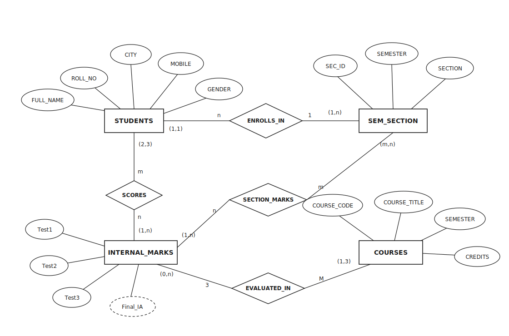
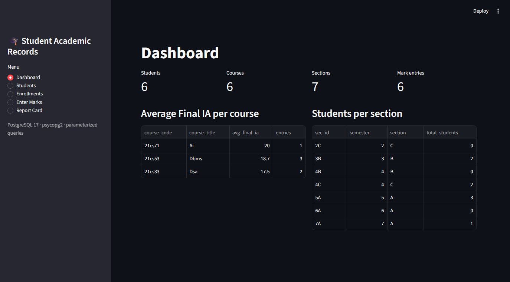
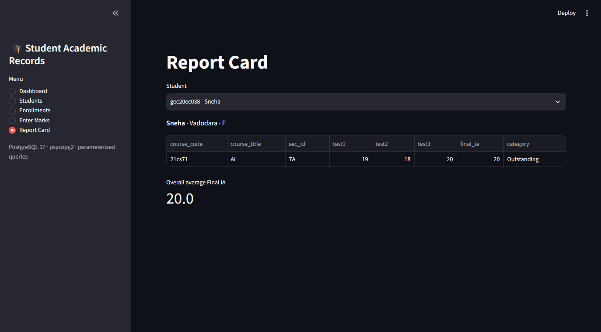
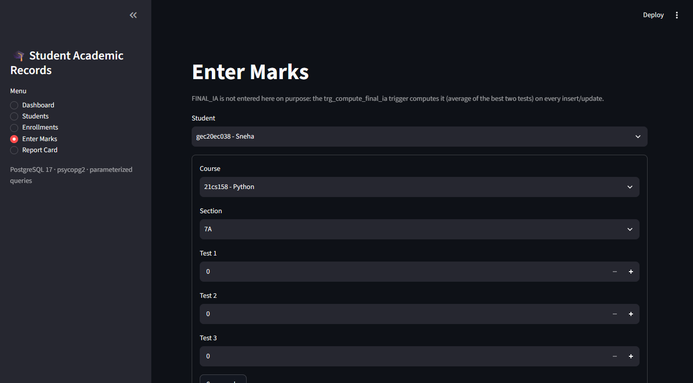
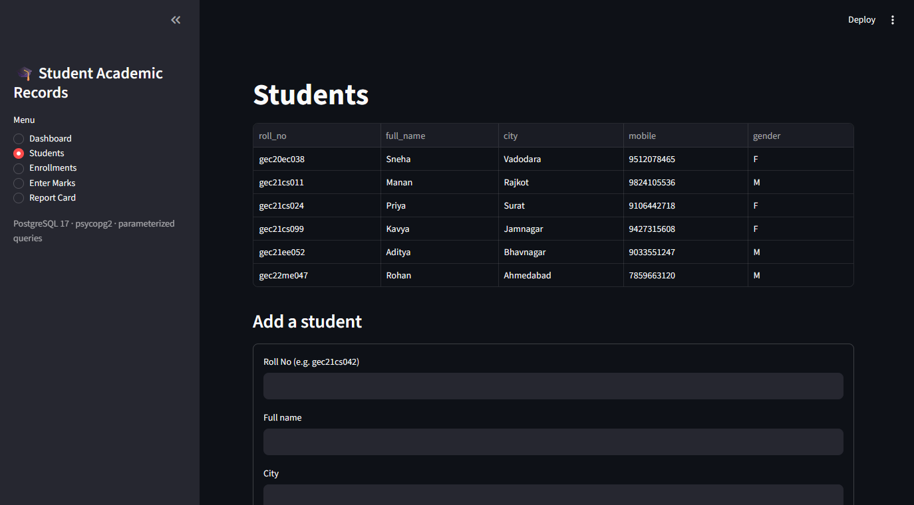

# 🎓 Student Academic Records Management System

A full-stack DBMS project: a normalized **PostgreSQL** database for managing students, course enrollments and internal-assessment marks, with a **Streamlit** web app on top for CRUD operations.

**🌐 Live demo:** https://student-academic-records.streamlit.app


## ✨ Highlights

- **Normalized schema (3NF)** with a junction table resolving the student ↔ section many-to-many relationship
- **Integrity constraints** — `CHECK`, `NOT NULL`, `UNIQUE`, composite keys, `ON DELETE CASCADE`
- **PL/pgSQL trigger** that auto-computes the final internal assessment (best two of three tests) on every insert/update
- **Advanced SQL** — correlated subqueries, `EXISTS`, `HAVING`, `LEFT JOIN`, views
- **Indexing** with `EXPLAIN ANALYZE` query-plan comparisons
- **ACID transactions** — `COMMIT`, `ROLLBACK`, `SAVEPOINT` demos
- **Web app** with SQL-injection-safe parameterized queries (psycopg2)
- **Deployed** on Streamlit Community Cloud + Neon serverless PostgreSQL

## 📊 Entity Relationship Diagram



- A student can be enrolled in multiple semester-sections through `CLASS_ENROLLMENT` (many-to-many).
- Each course belongs to a semester.
- `INTERNAL_MARKS` records a student's three test marks for a course in a particular section; the derived attribute `FINAL_IA` (dashed oval) is maintained by a trigger.

## 🗄️ Database Schema

| Table | Purpose | Key |
|---|---|---|
| `STUDENTS` | Student details (name, city, mobile, gender) | `ROLL_NO` |
| `SEM_SECTION` | Semester + section combinations | `SEC_ID` |
| `CLASS_ENROLLMENT` | Junction table: which student is in which section | `(ROLL_NO, SEC_ID)` |
| `COURSES` | Course catalogue with semester and credits | `COURSE_CODE` |
| `INTERNAL_MARKS` | Three test marks + computed Final IA per student/course/section | `(ROLL_NO, COURSE_CODE, SEC_ID)` |

## 📁 Project Files

| File | Contents |
|---|---|
| [`ddl.sql`](ddl.sql) | Table creation with all integrity constraints |
| [`triggers.sql`](triggers.sql) | PL/pgSQL trigger auto-computing `FINAL_IA` |
| [`dml.sql`](dml.sql) | Sample data inserts |
| [`queries.sql`](queries.sql) | The five core queries (joins, aggregation, view, `CASE` categorization) |
| [`advanced_queries.sql`](advanced_queries.sql) | Subqueries, correlated subqueries, `EXISTS`, `HAVING`, `LEFT JOIN` |
| [`indexes.sql`](indexes.sql) | Secondary indexes + `EXPLAIN ANALYZE` plans |
| [`transactions.sql`](transactions.sql) | `COMMIT` / `ROLLBACK` / `SAVEPOINT` demonstration |
| [`all_student_records_dbms.sql`](all_student_records_dbms.sql) | Everything in one runnable script |
| [`app.py`](app.py) | Streamlit CRUD web app |

## 🧩 Database Design Concepts

### Normalization (3NF)

- **1NF** — every attribute holds a single atomic value; each row is uniquely identified by a primary key.
- **2NF** — no partial dependencies on a composite key: in `INTERNAL_MARKS` (key `ROLL_NO, COURSE_CODE, SEC_ID`) the marks depend on the *whole* key — a mark is meaningless without the student, the course *and* the section. Student details live in `STUDENTS` because they depend only on `ROLL_NO`.
- **3NF** — no transitive dependencies: every non-key attribute in `STUDENTS` depends directly on `ROLL_NO` alone, and in `COURSES` on `COURSE_CODE` alone.
- The many-to-many student ↔ section relationship is resolved through the `CLASS_ENROLLMENT` junction table.

### Data Integrity

- `CHECK`: marks 0–25, semester 1–8, section A/B/C, gender M/F, credits 1–5, mobile exactly 10 digits
- `NOT NULL` on essential attributes; `UNIQUE` on mobile numbers
- `FOREIGN KEY ... ON DELETE CASCADE` — deleting a student removes their enrollments and marks automatically, so orphan rows cannot exist

### Trigger: automatic Final IA

A `BEFORE INSERT OR UPDATE` trigger on `INTERNAL_MARKS` recomputes `FINAL_IA` as the average of the best two of three tests (or `NULL` until all three tests have marks). The stored value can never go stale, and no application code is trusted to compute it.

### Indexing & Query Plans

Secondary indexes cover the join columns (`COURSE_CODE`, `SEC_ID`) and filter columns (`CITY`, `(SEMESTER, SECTION)`). `EXPLAIN ANALYZE` shows PostgreSQL choosing sequential scans on tiny tables — a demonstration of the read-speed vs. write-cost trade-off that only pays off as data grows.

### Transactions (ACID)

A multi-statement admission committed atomically, a `DELETE` undone with `ROLLBACK`, and a partial undo inside a transaction using `SAVEPOINT`.

## 💻 Web App

The Streamlit app demonstrates the full CRUD cycle against the database:

| Page | What it does |
|---|---|
| **Dashboard** | Live metrics, average Final IA per course, students per section |
| **Students** | List / add / delete students (delete cascades to enrollments and marks) |
| **Enrollments** | Enroll students into semester-sections |
| **Enter Marks** | Record test marks — `FINAL_IA` is filled in by the database trigger, not the app |
| **Report Card** | Per-student marks with Outstanding / Average / Weak categorization |

Every statement uses **parameterized queries** (`%s` placeholders via psycopg2) — user input is never concatenated into SQL, which prevents SQL injection. Invalid input (marks out of range, malformed mobile numbers) is rejected by the database's own constraints and surfaced in the UI.

### Screenshots

| Dashboard | Report Card |
|---|---|
|  |  |

| Enter Marks | Students |
|---|---|
|  |  |

## 🚀 Getting Started

### 1. Set up the database

```sh
# requires PostgreSQL (17 recommended)
createdb student_records
psql -d student_records -f ddl.sql
psql -d student_records -f triggers.sql
psql -d student_records -f dml.sql       # trigger fills in FINAL_IA automatically
```

Then explore `queries.sql`, `advanced_queries.sql`, `indexes.sql` and `transactions.sql` — or load everything at once:

```sh
psql -d student_records -f all_student_records_dbms.sql
```

### 2. Run the web app

```sh
pip install -r requirements.txt
streamlit run app.py
```

The app connects to `localhost:5432 / student_records / postgres` by default. Override with a `DATABASE_URL` (environment variable or Streamlit secret) or the standard `PGHOST`, `PGPORT`, `PGDATABASE`, `PGUSER`, `PGPASSWORD` variables.

## ☁️ Deployment

The live demo runs on **Streamlit Community Cloud**, deployed straight from this repository, with the database hosted on **Neon** (serverless PostgreSQL, free tier). The connection string is supplied as the `DATABASE_URL` Streamlit secret — no credentials live in the repository.

```
Browser ──▶ Streamlit Community Cloud (app.py) ──▶ Neon serverless PostgreSQL
                     ▲                                      ▲
                auto-deploys                          schema + trigger
                from GitHub main                      from ddl.sql / triggers.sql
```
